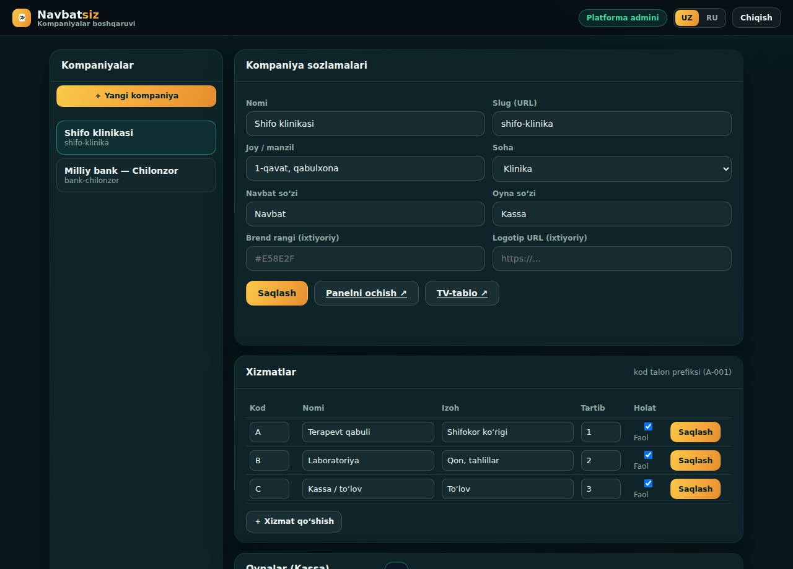
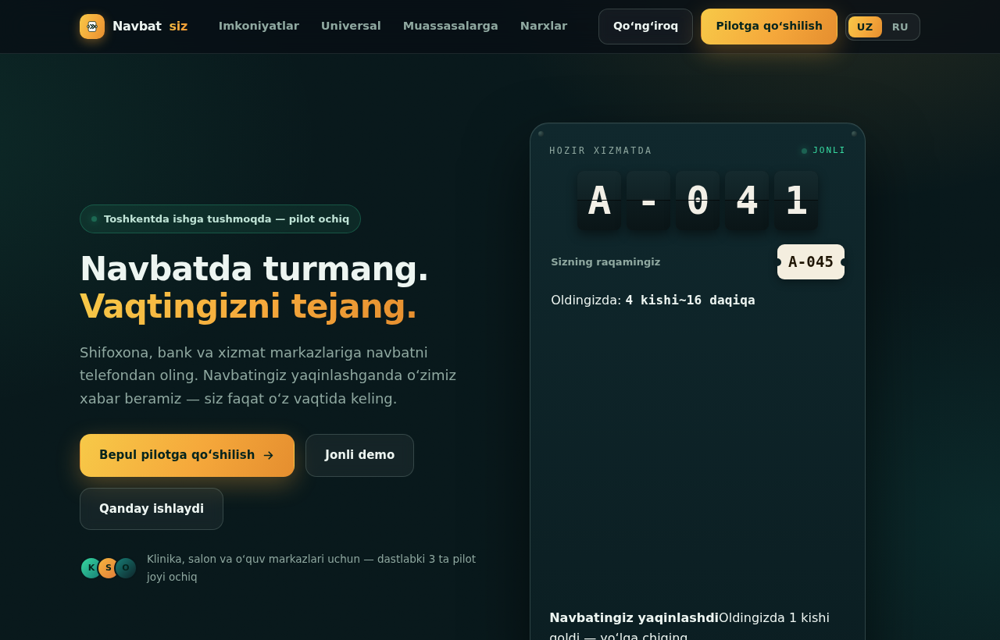
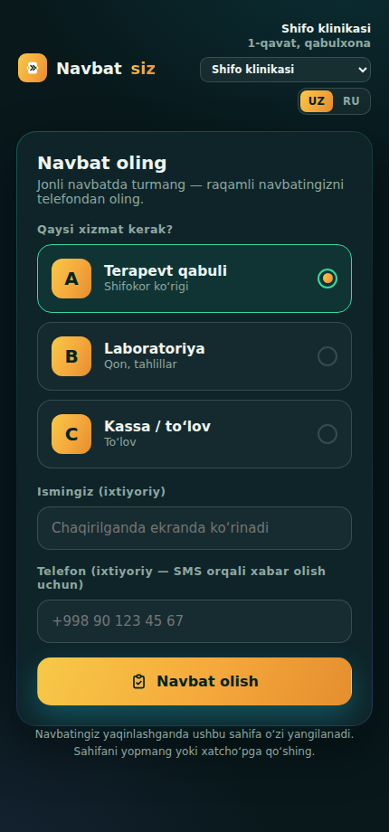
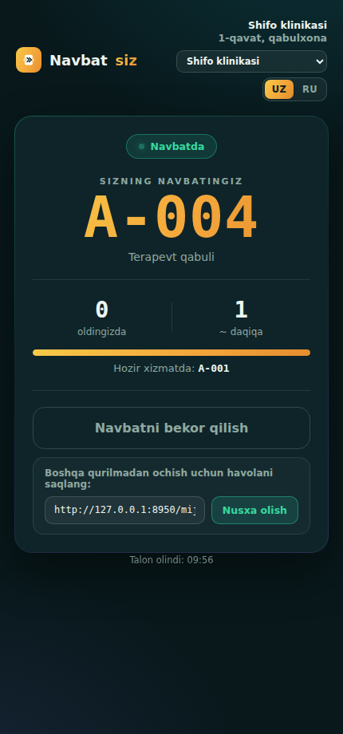
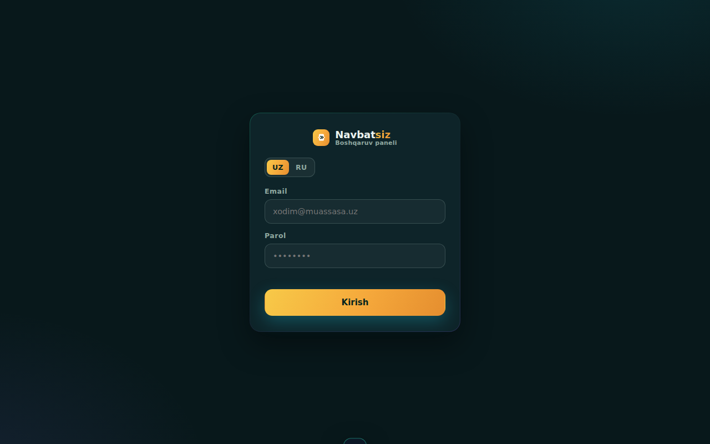
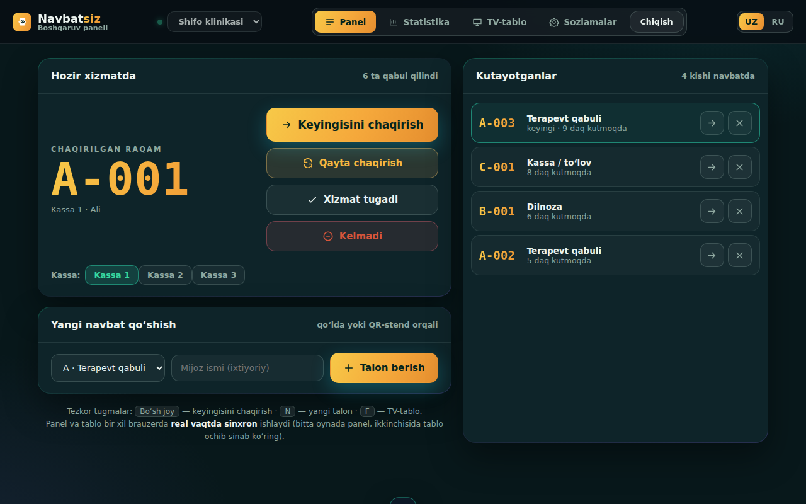
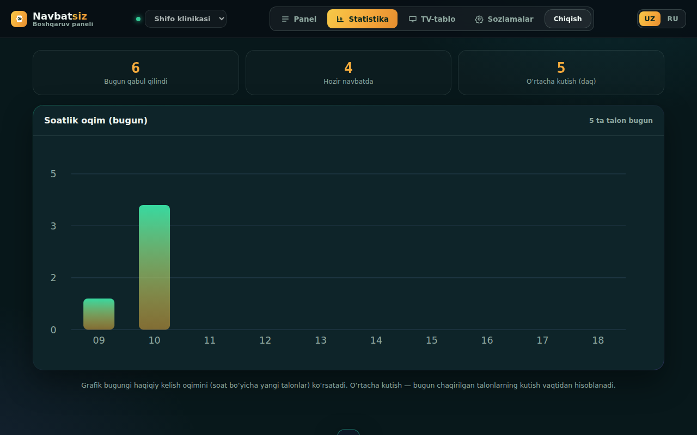
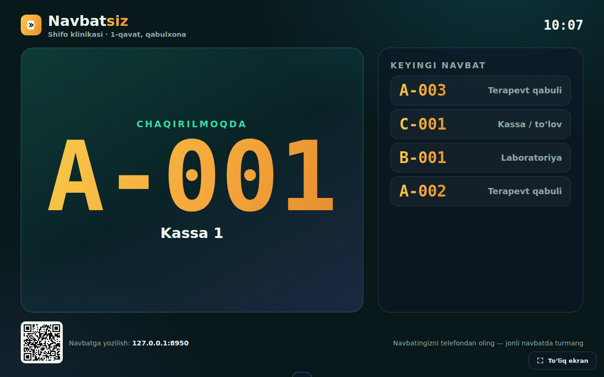

# Navbatsiz — to'liq qo'llanma

> Navbat boshqarish platformasi. Bu hujjat noldan ishga tushirishgacha
> hamma narsani bosqichma-bosqich tushuntiradi. Texnik bilim shart emas —
> qadamlarni ketma-ket bajaring.

---

## 1. Navbatsiz nima?

Mijoz telefondan raqamli navbat oladi, navbati yaqinlashganda xabar oladi,
kelganda QR bilan tasdiqlaydi. Muassasa xodimi paneldan navbatni
boshqaradi, TV-ekranda navbat ko'rinadi.

**Universal:** bitta tizim klinika, bank, davlat xizmati, salon,
avtoservis — istalgan soha uchun ishlaydi. Kod o'zgarmaydi, faqat sozlama.

**Beshta sahifa:**
| Sahifa | Kim uchun |
|--------|-----------|
| `index.html` | Marketing sayt (reklama, ariza) |
| `mijoz.html` | Mijoz — navbat oladi (telefon) |
| `panel.html` | Xodim — navbatni boshqaradi |
| `panel.html?view=tv` | Zaldagi TV-tablo |
| `admin.html` | Siz — kompaniya va xodim qo'shasiz |

---

## 2. Loyiha ichida nima bor

```
navbatsiz/
  public/            ← saytga joylanadigan fayllar
    index.html         marketing sayt
    mijoz.html         mijoz sahifasi
    panel.html         xodim paneli + TV
    admin.html         kompaniya boshqaruvi
    navbatsiz-db.js    Supabase ulanish (SIZ TO'LDIRASIZ)
    qr.js, sw.js       QR va PWA
    manifest.webmanifest, icon-*.png
  db/schema.sql      ← Supabase bazasi (bir marta ishga tushiriladi)
  supabase/functions/  ← push/SMS/xodim uchun server funksiyalari
  docs/              batafsil hujjatlar (DEPLOY, ONBOARDING, TASKS)
  README.md, CLAUDE.md, netlify.toml
```

---

## 3. Kerakli akkauntlar

| Xizmat | Nima uchun | Narx |
|--------|-----------|------|
| [Supabase](https://supabase.com) | Ma'lumotlar bazasi + login | **Bepul** (boshlash uchun) |
| [Netlify](https://netlify.com) | Saytni internetga joylash | **Bepul** |
| [Eskiz.uz](https://eskiz.uz) | SMS yuborish (ixtiyoriy) | Pullik |

Push-xabar (Web Push) **bepul** — alohida akkaunt kerak emas.

---

## 4. Noldan ishga tushirish

### 4.1. Supabase loyihasini oching

1. [supabase.com](https://supabase.com) → **New project**.
2. Nom bering, parol o'ylab toping, region: **Frankfurt** (eng yaqin).
3. Loyiha tayyor bo'lishini kuting (~2 daqiqa).

### 4.2. Bazani o'rnating

1. Chap menyudan **SQL Editor** → **New query**.
2. `db/schema.sql` faylini oching, **butun matnini** nusxalab, editorga
   qo'ying → **Run**.
3. "Success" chiqishi kerak. (Xavfsiz — istalgan payt qayta ishga
   tushirsangiz ham buzilmaydi.)

### 4.3. Kalitlarni oling va kodga qo'ying

1. Chap menyu → **Project Settings → API**.
2. Ikkita qiymatni nusxalang:
   - **Project URL** (masalan `https://abcd.supabase.co`)
   - **anon public** key
3. `public/navbatsiz-db.js` faylini oching, boshidagi ikki qatorni
   to'ldiring:
   ```js
   const SUPABASE_URL = 'https://abcd.supabase.co';   // o'zingiznikini
   const SUPABASE_ANON_KEY = 'eyJ...';                 // o'zingiznikini
   ```
   > `anon` kaliti ochiq (public) — uni frontend'da saqlash normal.
   > **`service_role` kalitini HECH QACHON bu yerga qo'ymang.**

### 4.4. O'zingizni "platforma admini" qiling

Faqat platforma admini yangi kompaniya ocha oladi. O'zingizni belgilang:

1. Supabase → **Authentication → Users → Add user** → o'zingizga email va
   parol bering.
2. Ro'yxatda paydo bo'lgan foydalanuvchining **User UID**'sini nusxalang.
3. **SQL Editor**'da:
   ```sql
   insert into platform_admins (user_id) values ('BU-YERGA-UID');
   ```

### 4.5. Netlify'ga joylang

**Eng oson:** [app.netlify.com/drop](https://app.netlify.com/drop) sahifasiga
`public/` papkani sichqoncha bilan sudrab tashlang. Bir necha soniyada
saytingiz manzil oladi (masalan `https://random-name.netlify.app`).

**Yoki** GitHub'ga yuklab, Netlify'ga ulang (`netlify.toml` avtomatik
`public/` papkani tanlaydi — har o'zgarishda avtomatik yangilanadi).

---

## 5. Birinchi kompaniyani qo'shish

`admin.html` sahifasini oching (masalan `sizning-sayt.netlify.app/admin.html`)
→ platforma admini emaili/paroli bilan **kiring**.



1. **"＋ Yangi kompaniya"** bosing.
2. Formani to'ldiring:
   - **Nomi** — masalan "Shifo klinikasi"
   - **Slug** — URL uchun, masalan `shifo-klinika` (mijoz havolasi shunga
     bog'liq)
   - **Soha**, **Joy/manzil**
   - **Navbat so'zi** (Navbat yoki Talon) va **Oyna so'zi** (Kassa /
     Deraza / Stol / Usta / Post) — sohangizga moslang
   - **Brend rangi** va **Logotip URL** — ixtiyoriy (kompaniya ko'rinishi
     shunga moslashadi)
3. **Saqlash** → so'ng **Xizmatlar** (A, B, C...) va **Oynalar** qo'shing.

---

## 6. Xodim qo'shish

Admin sahifasidagi **"Xodimlar"** bo'limida:

**Oson yo'l (Edge Function o'rnatilgan bo'lsa):** email + parol + rol
kiriting → **"Akkaunt yaratish"**. Xodim darhol panelga kira oladi.
(Edge Function o'rnatish: 8-bo'lim.)

**Oddiy yo'l:** Supabase → Authentication → Users'da xodimga email+parol
yarating → uning **user_id**'sini admin sahifasidagi zaxira formaga
kiriting. Rol:
- **admin** — o'z kompaniyasi sozlamalarini tahrirlaydi
- **operator** — faqat navbatni boshqaradi

---

## 7. Sahifalar qanday ishlaydi

### 7.1. Marketing sayt (`index.html`)
Reklama sahifasi — imkoniyatlar, narxlar, "Jonli demo" tugmasi va ariza
formasi. UZ/RU tilini almashtiradi.



### 7.2. Mijoz sahifasi (`mijoz.html`)
Mijoz `sayt.uz/mijoz.html?b=shifo-klinika` havolasiga kiradi (yoki zaldagi
QR'ni skanerlaydi). Xizmatni tanlaydi, ismini (va ixtiyoriy telefon)
kiritadi, **Navbat olish** bosadi.



Talon olgach — o'z raqamini, oldida nechta kishi borligini, taxminiy
vaqtni ko'radi. Navbati kelganda ekran o'zi yangilanadi va signal beradi.
"Boshqa qurilmadan ochish" havolasi bilan istalgan telefonda navbatini
tiklaydi.



### 7.3. Xodim paneli (`panel.html`)
Xodim email/parol bilan kiradi (kirmagan odam panelni ko'rmaydi).



So'ng o'z kompaniyasi navbatini boshqaradi: **Keyingisini chaqirish**,
**Qayta chaqirish**, **Xizmat tugadi**, **Kelmadi**, qo'lda talon berish.
Oyna (Kassa) tanlaydi. Hammasi real vaqtda — mijoz telefonida darhol
ko'rinadi.



**Statistika** — bugungi haqiqiy kelish oqimi (soat bo'yicha) va o'rtacha
kutish vaqti.



### 7.4. TV-tablo (`panel.html?view=tv&b=shifo-klinika`)
Zaldagi televizor/monitorda ochiladi — login talab qilmaydi (faqat
o'qiydi). Hozir chaqirilayotgan raqam, keyingilar ro'yxati va navbatga
yozilish uchun **haqiqiy QR-kod**. "To'liq ekran" tugmasi bor.



---

## 8. Push-xabar yoqish (bepul, ixtiyoriy)

Mijoz sahifani yopsa ham "navbatingiz yaqinlashdi / chaqirildingiz" xabari
telefoniga keladi. Buning uchun bir martalik sozlash kerak (kompyuterda
`supabase` buyrug'i — [CLI o'rnatish](https://supabase.com/docs/guides/cli)):

1. VAPID kalitlar yarating:
   ```bash
   npx web-push generate-vapid-keys
   ```
   - **Public Key** → `public/navbatsiz-db.js`dagi `VAPID_PUBLIC_KEY`.
   - **Private Key** → keyingi qadamda.
2. Maxfiy qiymatlarni bering:
   ```bash
   supabase secrets set \
     VAPID_PUBLIC_KEY=<public> \
     VAPID_PRIVATE_KEY=<private> \
     VAPID_SUBJECT=mailto:siz@email.uz \
     SITE_URL=https://sizning-sayt.netlify.app
   ```
3. Funksiyani joylang:
   ```bash
   supabase functions deploy send-push --no-verify-jwt
   ```
4. **Database Webhook** yarating: Supabase → Database → Webhooks → New:
   - Jadval: `public.tickets`, hodisalar: **Insert** + **Update**
   - Turi: **Supabase Edge Functions** → `send-push`

> `VAPID_PUBLIC_KEY` bo'sh bo'lsa mijozda push tugmasi umuman ko'rinmaydi
> — tizim push'siz ham to'liq ishlaydi.

---

## 9. SMS yoqish (Eskiz.uz, ixtiyoriy)

Ilova/push ishlatmaydigan mijozlar SMS oladi (telefon kiritsa). Eskiz.uz
akkaunti kerak.

1. [Eskiz.uz](https://eskiz.uz)'da ro'yxatdan o'ting, sender nomini
   tasdiqlating (test uchun `4546`).
2. Maxfiy qiymatlar:
   ```bash
   supabase secrets set \
     ESKIZ_EMAIL=<eskiz-email> \
     ESKIZ_PASSWORD=<eskiz-parol> \
     ESKIZ_FROM=4546
   ```
3. Joylang: `supabase functions deploy send-sms --no-verify-jwt`
4. Database Webhook: push bilan bir xil (tickets Insert+Update →
   `send-sms`).

Push va SMS mustaqil — birini yoki ikkalasini yoqishingiz mumkin.

---

## 10. Sinov ro'yxati (har joylashdan keyin)

Ikki qurilma (yoki brauzer + telefon) bilan:

- [ ] `panel.html` — login talab qiladimi (kirmagan odam panelni ko'rmaydi)?
- [ ] Xodim kiradi — o'z kompaniyasi navbatini ko'radimi?
- [ ] Telefonda `mijoz.html?b=<slug>` → talon olindimi?
- [ ] Panelda o'sha talon 1-2 soniyada paydo bo'ldimi (real vaqt)?
- [ ] Paneldan "Keyingisini chaqirish" → telefonda banner + signal?
- [ ] `panel.html?view=tv&b=<slug>` — ismlar KO'RINMAYDI (maxfiylik)?
- [ ] Tiklash havolasi boshqa brauzerda ochiladimi?
- [ ] Bir telefondan 6+ talon → 6-chisida "juda ko'p urinish"?

Batafsil: `docs/DEPLOY.md`.

---

## 11. Muammolar

| Belgi | Yechim |
|-------|--------|
| Panel login'dan o'tmayapti | `navbatsiz-db.js`dagi URL/anon key to'g'rimi? |
| "Sizga filial biriktirilmagan" | Xodim `staff` jadvaliga qo'shilmagan (6-bo'lim) |
| Mijoz talon ololmayapti (rate_limited) | Bir IP daqiqada 5 ta — 1 daqiqa kuting |
| Real vaqt ishlamayapti | Supabase → Database → Replication'da `tickets` bormi (schema o'zi qo'shadi) |
| Push kelmayapti | VAPID kalit, secrets, webhook to'g'ri o'rnatilganmi (8-bo'lim)? |

---

## 12. Tez-tez so'raladigan savollar

**Mijozlar uchun ilova pullikmi?** Yo'q, mijozlar uchun butunlay bepul.
Faqat muassasalar oylik obuna to'laydi.

**Qanday uskuna kerak?** Hech qanday maxsus uskuna emas — xodim paneli
oddiy telefon/planshet/kompyuter brauzerida ishlaydi. Zalga QR-stend
qo'ysangiz kifoya.

**Har xil sohaga qanday moslashadi?** Kod o'zgarmaydi — admin sahifasidan
"Navbat so'zi" va "Oyna so'zi"ni o'zgartirasiz (Talon/Deraza, Navbat/Usta
va h.k.), xizmatlarni sozlaysiz. Xolos.

**Ilovasi yo'q mijozlar?** Zalda odatdagidek talon olishadi — tizim ikkala
oqimni bitta navbatga birlashtiradi.

---

*Batafsil texnik hujjatlar: `docs/DEPLOY.md` (joylash), `docs/ONBOARDING.md`
(kompaniya/xodim/push/SMS), `docs/TASKS.md` (ish tarixi).*

*Asoschi: Abduraxmatov Anvarjon · Toshkent · 2026*
